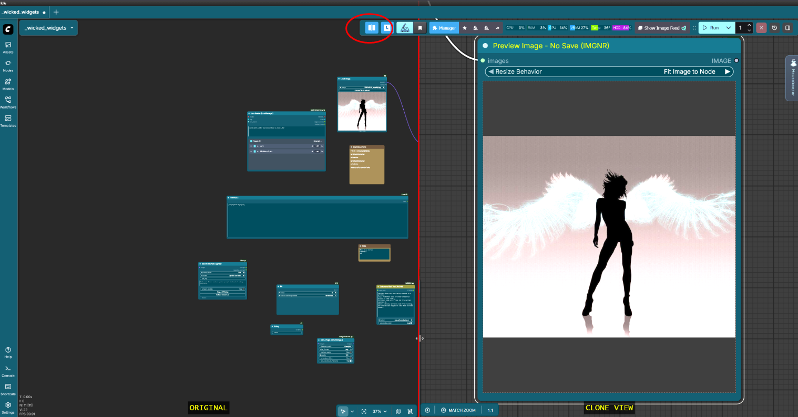
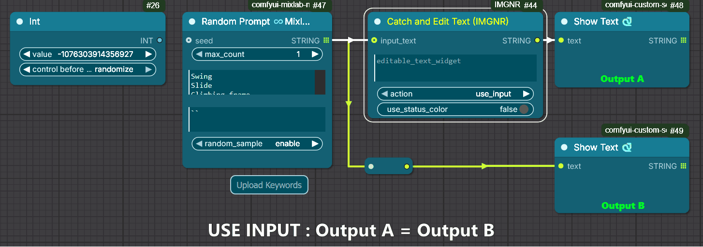
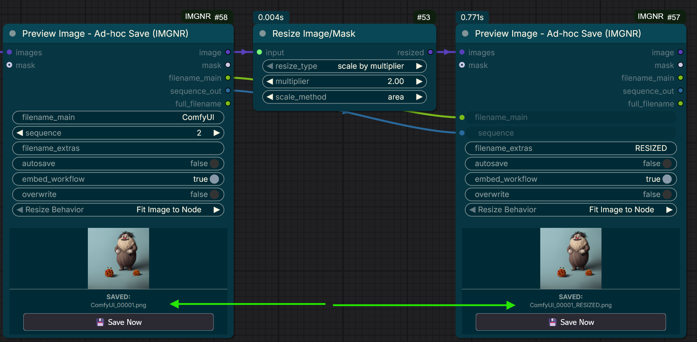
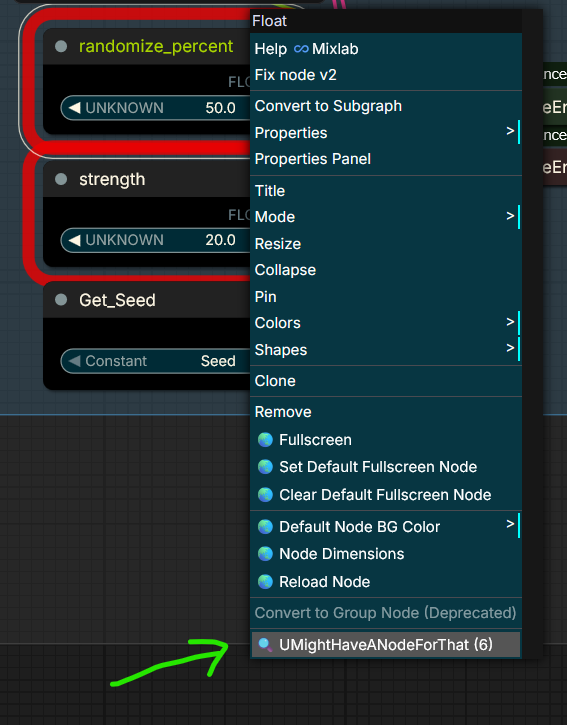
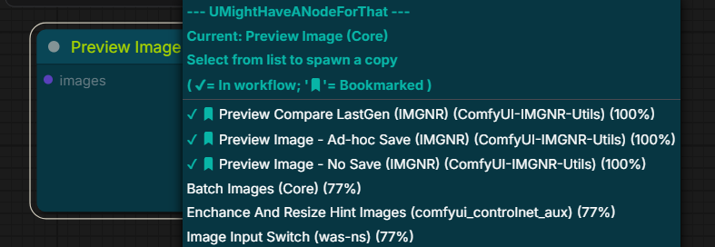
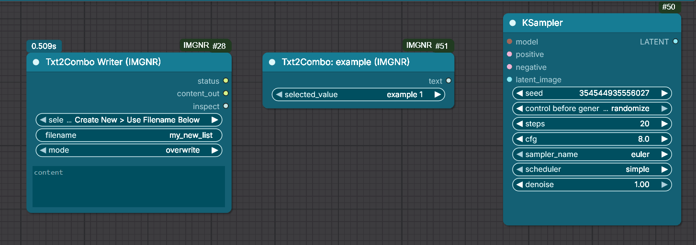

# ComfyUI-IMGNR-Utils *In fieri* <!-- omit from toc -->

**A Quality-of-Life node pack designed to solve specific annoyances, reduce clicking, and keep your workflow clean.**

> **Philosophy:**
> 
> * Don't re-invent the wheel.
> * Make ComfyUI easier to use, not harder.
> * Solve actual workflow bottlenecks with minimal external dependencies.
> * Minimal Change, Maximum Effect.

---

## Contents <!-- omit from toc -->

- [🛠️ The Utilities](#️-the-utilities)
  - [1. Split Screen View](#1-split-screen-view)
  - [2. Catch \& Edit Text](#2-catch--edit-text)
  - [3. Preview Image (No Save)](#3-preview-image-no-save)
  - [4. Preview Image (Ad-Hoc Save)](#4-preview-image-ad-hoc-save)
  - [5. Node Matcher ("U Might Have A Node For That")](#5-node-matcher-u-might-have-a-node-for-that)
  - [6. Txt2Combo (Autonodes)](#6-txt2combo-autonodes)
- [📥 Installation](#-installation)
- [📋 ChangeLog (V3.0.0)](#-changelog-v300)
- [⚠️ Disclaimer \& Credits](#️-disclaimer--credits)

---

## 🛠️ The Utilities

### 1. Split Screen View

**Dual viewports for large workflows.** *(**NOT!!** Nodes 2.0 compatible)*

Adds a "Split Screen" toggle to the main toolbar, allowing you to view two independent areas of the same workflow simultaneously.

* **Independent Navigation:** Zoom in on a control group in the Left Pane while watching the results in the Right Pane.
* **Shared Graph:** Moving a node in one view moves it in the other.
* **State Saving:** Remembers your split position and camera coordinates in the workflow metadata.
* *(Experimental)* Toggle interaction on/off for the secondary view.

 *(Shift+Click icon for settings)*



[Example SplitScreen Video](img/SplitScreen.mp4)

---

### 2. Catch & Edit Text

**Manual control for generated prompts.** *(Nodes 2.0 compatible)*

Often, AI-generated prompts (e.g., from dynamic prompt nodes) are *almost* perfect but need a human touch. A little change of words, removing some nonsense, etc. Or maybe you now want a *blue* car instead of a *red* one. You don't need an completely new generated prompt for that, costing valuable resources and possibly rated API calls. 
This `Catch & Edit Text` node shows text being created by a previous node and enables editing the text for subsequent runs.

* **Edit & Continue:** After the initial run, tweak the text in the box, and continue processing.
* **Save Resources:** When editing, the node can mute the previous generator to prevent wasted API calls or regeneration.
* **Visual Clarity:** toggle to show selected mode on node header.(Green=Pass input, Yellow=Soft Mute, Red=Hard Block)

**Modes (`action` switch):**

* **`Use_input`**: Passes the incoming text through unchanged. (overwrites Editblock with newly generated content, ready to edit)
* **`Use_edit_mute_Input`**: Uses your edited text and **soft mutes** the input node (saving resources).
* **`Use_edit_BLOCK_inputnode`**: Uses your edited text and **hard blocks** the input node (prevents execution even if upstream seeds change).



---

### 3. Preview Image (No Save)

**A true disposable preview.** *(Nodes 2.0 compatible)*

Standard "Preview Image" nodes save files to your `ComfyUI\temp` directory, which persists until the server restarts. This node sends the image directly to your browser memory without writing to the disk.

* **Zero Clutter:** On page reload, the image is gone.
* **Privacy:** No residual files left on the server.
* **Flexible:** Supports resizing options, RGBA images, and masks.

---

### 4. Preview Image (Ad-Hoc Save)

**Preview now, save later.** *(Nodes 2.0 compatible)*

Behaves like the "No Save" node by default (images are disposable), but gives you the option to save specific successful generations without re-running the workflow.

* **Manual Save:** Click the button to save the current image immediately.
* **Auto-Save Toggle:** Switch `autosave` to true to capture the next run automatically.
* **Filename Sync:** Supports `filename_main` and `sequence` inputs to keep multiple outputs (e.g., Original vs. Upscaled) in sync with the same index number.



---

### 5. Node Matcher ("U Might Have A Node For That")

**Stop installing duplicate node packs.** *(Nodes 2.0 compatible)*

When loading workflows from CivitAI or Reddit, you often see missing nodes. This utility helps you find equivalent nodes you **already have installed** based on inputs, outputs, and functionality.

* **Usage:** Right-click any node (missing or existing) to see a ranked list of alternatives.
* **Smart Matching:** Matches based on Name, S&R Name, Inputs, and Outputs.
* **Core Awareness:** Identifies standard ComfyUI nodes as `*(Core)` to help you reduce dependencies.
* **Settings:** Tweak search sensitivity in `ComfyUI Settings > IMGNR`.

| Right-Click Menu | Ranked Results |
| :---: | :---: |
|  |  |

> ***NOTE:*** As not all nodes have clear descriptions and input/output, the matching is based on 'name', 'S&R name', 'inputs' and 'outputs'. It could therefor also rank nodes that are actually different. But it could also rank nodes that don't *seem* to match, but actually *do*.

---

### 6. Txt2Combo (Autonodes)

**Dynamic dropdown lists.** *(Nodes 2.0 compatible)*

Create your own dropdown selection nodes using simple text files. This is ideal for prompt styles, camera models, or frequently used settings.

* **Create:** Use the `Txt2Combo Writer` node (or edit files in `User/IMGNR-Utils/txt2combo`) to create and maintain your custom combonodes.
* **Connect:** Link your Txt2Combo node `text` output to the combobox of another node.
* **Use:** Select your value from the dropdown.

**Advanced Features:**

* **Multi-Combo:** Use brackets `[Section Name]` in your text file to create one node with multiple dropdowns and outputs.
* **Inspect:** Connect the Writer `inspect`-output to an existing combo input on *any* node to import its values into the editor box to then cherrypick and make your custom list.[^1]




> ***NOTE:***
>
> - *Editing items inside existing sections only requires a Refresh (R).*
> - *Adding new files (Nodes) or `[Sections]` requires a Server Restart to update the nodes. (`filename` --> Node Name: `Txt2Combo Filename`)*

---

## 📥 Installation

**Option 1: ComfyUI Manager (Recommended)**

> Search for `ComfyUI-IMGNR-Utils` in the Custom Node Manager.

**Option 2: Manual Clone**

```bash
cd ComfyUI/custom_nodes/
git clone https://github.com/ImagineerNL/ComfyUI-IMGNR-Utils]
```

**Option 3: ComfyRegistry**

```bash
  comfy node registry-install ComfyUI-IMGNR-Utils
```

## 📋 ChangeLog (V3.0.0)

| Version | | Notable Changes |
| :-------------: | :-------------: | :------------- |
| V3.0.0 | | Added new Utility [Split Screen View](#1-split-screen-view) ; [Preview Image (Ad-Hoc Save)](#4-preview-image-ad-hoc-save) ; Consolidated Settings file ; UI Fixes and Cleanup/Documentation. |
| | V2.3.0 | Txt2Combo Support for multiple comboboxes in 1 node, Fix: Catch&Edit Text hover showed full inputnode text |
| | V2.2.0 | Fix Issue [#3](https://github.com/ImagineerNL/ComfyUI-IMGNR-Utils/issues/3), [#6](https://github.com/ImagineerNL/ComfyUI-IMGNR-Utils/issues/6) ; Tweaks on Catch \& Edit Text and "Preview Image - No Save", ; New Nodes: Txt2Combo Autonodes ; Added Node Descriptions and tooltips. |
| | V2.1.0 | Fix menu-item showing up unwanted and added menu in ComfyUI Settings for tweaking search/matching |
| V2.0.0 | | Added new Utility: [Node Matcher ("U Might Have A Node For That")](#5-node-matcher-u-might-have-a-node-for-that) |
| V1.0.0 | | Initial Upload |

## ⚠️ Disclaimer & Credits
**Usage:** As with any file you download from the internet: **Use at your own risk**. While tested, this is a personal passion project. Even though I have a degree in IT, I am no programmer by trade. This is a passion project for my own specific usecases and I'm sharing it so other people can benefit from it, the same way as i benefit from other people's work.

**Credits & Inspiration:**

- [ComfyUI Outputlists Combiner](https://github.com/geroldmeisinger/ComfyUI-outputlists-combiner) by Gerold Mesinger
- [Custom Scripts](https://github.com/pythongosssss/ComfyUI-Custom-Scripts) by Pythongosssss
- [Inpaint Crop&Stitch](https://github.com/lquesada/ComfyUI-Inpaint-CropAndStitch) and [Interactive nodes](https://github.com/lquesada/ComfyUI-Interactive) by Luis Quesada

- [Screen 2 Gif Screenrecorder](https://github.com/NickeManarin/ScreenToGif) by Nicke Manarin for animations in this readme

- [Split Screen Icon](https://thenounproject.com/icon/split-screen-6095990/) by Yudhi Restu Pebriyanto from Noun Project (CC BY 3.0)
  
**Definitely worth checking out:**
- [ComfyUI Nvidia Docker](https://github.com/mmartial/ComfyUI-Nvidia-Docker) by MMartial
- [LoRaManager](https://github.com/willmiao/ComfyUI-Lora-Manager) by Willmiao
- [Smart ComfyUI Gallery](https://github.com/biagiomaf/smart-comfyui-gallery) by Biagiomaf
- [ComfyUI-ToSVG-Potracer](https://github.com/ImagineerNL/ComfyUI-ToSVG-Potracer), Smooth BW Image to Vector made by me (Shameless self-plug)

[^1]: *The 'inspect' code is heavily inspired on the `inspect combo` in the `String Outputlist` node of [ComfyUI Outputlists Combiner by Gerold Mesinger](https://github.com/geroldmeisinger/ComfyUI-outputlists-combiner). Therefor, the Txt2Combo Node and code is licensed under the [GPL-3.0 license](https://www.gnu.org/licenses/gpl-3.0.txt).*