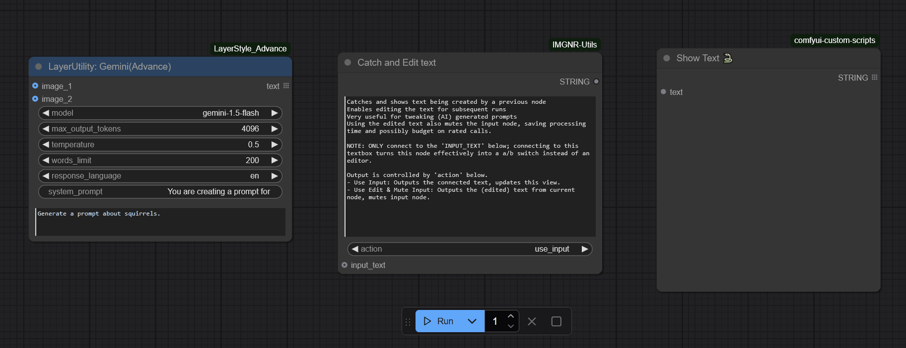

# ComfyUI-IMGNR-Utils; *In fieri*

- [ComfyUI-IMGNR-Utils; *In fieri*](#comfyui-imgnr-utils-in-fieri)
  - [Updates](#updates)
  - [Utilities](#utilities)
    - [1. Catch \& Edit Text (IMGNR)](#1-catch--edit-text-imgnr)
    - [2. "Preview Image - No Save (IMGNR)"](#2-preview-image---no-save-imgnr)
    - [3. "U Might Have A Node For That"](#3-u-might-have-a-node-for-that)
  - [Installation](#installation)
  - [Sources, Shoutouts, Love and Inspiration](#sources-shoutouts-love-and-inspiration)
  - [To Do](#to-do)
  - [Disclaimer](#disclaimer)

## Updates

- *(2026-01-02)* V 2.0.0 Added new Utility: [UMightHaveANodeForThat](#3-u-might-have-a-node-for-that)

## Utilities
I created this as a custom node pack, as it is intended to become one place for multiple smaller utilities.
Currently it only consists of Catch and Edit Text (Catch_Edit_Text) but will hopefully grow out to be more.
My other B/W SVG conversion node, [ComfyUI-ToSVG-Potracer](https://github.com/ImagineerNL/ComfyUI-ToSVG-Potracer), is currently a standalone node, due to its nature and requiring external nodepacks.

### 1. Catch & Edit Text (IMGNR)

Usecase for this node is the loss of control I found when having my text prompts created by either an AI or a random generator. Pythongosssss has a great node that shows you the output of the text, called '[Show Text](https://github.com/pythongosssss/ComfyUI-Custom-Scripts?tab=readme-ov-file#show-text)', which at least shows you the prompt being generated. However, I often wanted to tweak the prompt to my personal likings, or simply because the output wasn't to my liking. But when you want to change that prompt, you have to create a new string of nodes and mix it with a switch to either take the generated prompt or your custom text. And there's no link between the generated prompt and your edits.

Besides that, I was also worried I might run through my rate limit when calling an external AI, while the output of the generated prompt didnt even differ that much between the runs.

*Enter Catch & Edit Text*; a node that Catches and shows text being created by a previous node and enables editing the text for subsequent run. Using the edited text also mutes the input node, saving processing time and possibly budget on rated calls. The example below shows the workings of the node. Of course, the current output to the 'Show Text' node is useless and just for reference.

| |
| :-------------: |
|  |
| *Example workflow Catch and Edit Text* |

- NOTE: ONLY connect to the `INPUT_TEXT` below;  Connecting to the textbox turns this node effectively into a a/b switch instead of an editor.

- Output is controlled by `action` switch.
  - `Use Input`: Outputs the connected text, updates this view.
  - `Use Edit_Mute_Input`: Outputs the (edited) text from current node, mutes input node.

------------------

### 2. "Preview Image - No Save (IMGNR)"

- Default "Preview"-nodes store their file in the ``ComfyUI\temp`` directory, before displaying it to the user. On reload of the page, the image is gone for the client, but it remains in the temp directory on the ComfyUI server. As this directory gets cleared upon ***next launch*** of the ComfyUI instance, the node isnt behaving like an actual disposable preview. And when you dont own the server, you have no influence on those cleanups.
- "Preview Image - No Save (IMGNR)" does not create the file on disk; instead it sends it directly to the client, that loads it in the browser cache. On reload of the page, or when the next prompt is run, the preview is gone forever.
You can opt to connect other image nodes for further processing that you *do* want to save.

**And... why is this useful?**

1. If you're creating a preview not intended to save, why keep it?
2. If you're deciding you don't want an image; why is it still saved somewhere?
3. Don't waste space with images saved in a location hard to reach.

------------------

### 3. "U Might Have A Node For That"

Don't you hate it when you open a workflow from CivitAI, Openart.ai, Reddit or wherever and you get a whole bunch of red blocks of missing nodes and nodepacks? Even more frustrating when you discover you need to install a nodepack with functionality you already have? Like, how many 'INT-', 'String-' or 'Load Image-' nodes do you actually need?

***"UMightHaveANodeForThat"** entered the chat*

- A right-click menu item on your nodes, which enables you to easily find and spawn nodes with matching functionality.
- As not all nodes have clear descriptions and input/output, the matching is based on 'name', 'S&R name', 'inputs' and 'outputs'. It could therefor also rank nodes that are actually different. But it could also rank nodes that don't *seem* to match, but actually *do*.
- Also works wonders on trying to use as few custom nodepacks as possible in your workflow, and marks core comfyUI nodes as *(Core)

| | |
| :-------------: | :-------------: | 
|  |   |
| *RightClick on an an existing or missing node, listed on the bottom* | *popup with ranked list of matching (installed) nodes* |

------------------

## Installation

- Loading the [Example Workflow](/example_workflows/Catch_Edit_Text_Example_Workflow.json) here or from [Openart.ai](https://openart.ai/workflows/awkward_monster00/catch-edit-text/YAvjBwemGeCnuuoMLxTx) and allowing ComfyUI to install missing nodes.
  
- Using ComfyUI Manager --> Custom Node Manager --> Search for:

        ComfyUI-IMGNR-Utils

- Using comfyregistry manual installation:

        comfy node registry-install ComfyUI-IMGNR-Utils

- Manual Installation
  1. Navigate to your /ComfyUI/custom_nodes/ folder.
  2. Run the following command to clone the repository:

          git clone https://github.com/ImagineerNL/ComfyUI-IMGNR-Utils

  3. *(Currently no requirements to install, this is for future reference)* Navigate to your ComfyUI-IMGNR-Utils folder.
       - Command for Portable/venv:

             path/to/ComfUI/python_embeded/python.exe -s -m pip install -r requirements.txt

       - Command for system Python:

             pip install -r requirements.txt

## Sources, Shoutouts, Love and Inspiration

- [Custom Scripts node pack by Pythongosssss](https://github.com/pythongosssss/ComfyUI-Custom-Scripts)
- [StabilityMatrix](https://github.com/LykosAI/StabilityMatrix)
- Luis Quesada's [Inpaint Crop&Stitch](https://github.com/lquesada/ComfyUI-Inpaint-CropAndStitch) and [Interactive nodes](https://github.com/lquesada/ComfyUI-Interactive)
- Shameless self plug: BW Image to Vector with [ComfyUI-ToSVG-Potracer](https://github.com/ImagineerNL/ComfyUI-ToSVG-Potracer)
- Gemini AI

## To Do

- [X] Deploy V1 to Github
- [X] Deploy to Comfyregistry
- [ ] Real life testing & feedback
- [ ] Continue building on Utility*pack*

## Disclaimer

While tested thoroughly, and as with all custom nodes, **USE AT YOUR OWN RISK**.
While tested a lot and I have IT knowledge, I am no programmer by trade. This is a passion project for my own specific usecase and I'm sharing it so other people might benefit from it just as much as i benefitted from others. I am convinced this implementation has its flaws and it will probably not work on all other installations worldwide.
I can not guarantee if this project will get more updates and when.
