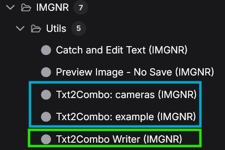
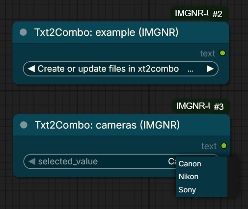
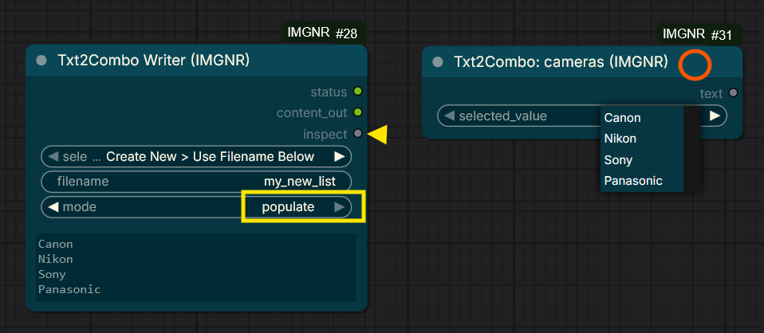

# ComfyUI-IMGNR-Utils; *In fieri* <!-- omit from toc -->

- [Utilities](#utilities)
  - [1. Catch \& Edit Text (IMGNR)](#1-catch--edit-text-imgnr)
  - [2. "Preview Image - No Save (IMGNR)"](#2-preview-image---no-save-imgnr)
  - [3. "U Might Have A Node For That"](#3-u-might-have-a-node-for-that)
  - [4. "Txt2Combo (IMGNR) Autonodes"](#4-txt2combo-imgnr-autonodes)
    - [Multi-Combo Support](#multi-combo-support)
    - [Usage Note](#usage-note)
- [Installation](#installation)
- [Sources, Resources, Shoutouts, Love and Inspiration](#sources-resources-shoutouts-love-and-inspiration)
- [ChangeLog *V2.2.0 (2026-01-09)*](#changelog-v220-2026-01-09)
- [To Do / Known Issues](#to-do--known-issues)
- [Disclaimer](#disclaimer)

## Utilities

I created this custom node pack with small Quality of Life utilities, based on the following rules:

- Don't re-invent the wheel
- Solve actual issues or annoyances
- Small change, big impact
- Make ComfyUI easier to use, not harder
- Require as little external resources as possible.

My other B/W SVG conversion node, [ComfyUI-ToSVG-Potracer](https://github.com/ImagineerNL/ComfyUI-ToSVG-Potracer), is currently a standalone node, due to its nature and requiring external nodepacks.

### 1. Catch & Edit Text (IMGNR)

Usecase for this node is the loss of control I found when having my text prompts created by either an AI or a random generator. Pythongosssss has a great node that shows you the output of the text, called '[Show Text](https://github.com/pythongosssss/ComfyUI-Custom-Scripts?tab=readme-ov-file#show-text)', which at least shows you the prompt being generated. However, I often wanted to tweak the prompt to my personal likings, or simply because the output wasn't to my liking. But when you want to change that prompt, you have to create a new string of nodes and mix it with a switch to either take the generated prompt or your custom text. And there's no link between the generated prompt and your edits.

Besides that, I was also worried I might run through my rate limit when calling an external AI, while the output of the generated prompt didnt even differ that much between the runs.

- *Enter Catch & Edit Text*; a node that Catches and shows text being created by a previous node and enables editing the text for subsequent run. Using the edited text also mutes the input node, saving processing time and possibly budget on rated calls. The example below shows the workings of the node. Of course, the current output to the 'Show Text' node is useless and just for reference.

  | |
  | :-------------: |
  |  |
  | *Example workflow Catch and Edit Text* |

  - NOTE: ONLY connect to the `INPUT_TEXT` below; <br>Connecting to the textbox turns this node effectively into a a/b switch instead of an editor.

  - Output is controlled by `action` switch.
    - `Use_input`: Outputs the connected text, updates this view.
    - `Use_edit_mute_Input`: Outputs the (edited) text from current node, mutes input node*. 

      > *If the inputnode is forced to run (by e.g. 'randomize seed' or other connected output to that node), the input node still runs but the catcher ignores it. This can cause confusion on the term 'mute'. To fix this, I added a new option:*
    - `Use_edit_BLOCK_inputnode`: Actively prevents the previous node from executing. Uses the widget text.

    - `Use_statuscolor` toggle to visualy show selected mode on node header.(Green=Pass input, Yellow=Soft Mute, Red=Hard Block)"

------------------

### 2. "Preview Image - No Save (IMGNR)"

- Default "Preview"-nodes store their file in the ``ComfyUI\temp`` directory, before displaying it to the user. On reload of the page, the image is gone for the client, but it remains in the temp directory on the ComfyUI server. As this directory gets cleared upon ***next launch*** of the ComfyUI instance, the node isnt behaving like an actual disposable preview. And when you dont own the server, you have no influence on those cleanups.
- **"Preview Image - No Save (IMGNR)"** does not create the file on disk; instead it sends it directly to the your screen. On reload of the page, or when the next prompt is run, the preview is gone into the abyss
  - You can opt to connect other image nodes for further processing that you *do* want to save.
  - Added toggle to Resize node to fit the image *OR*` Scale imagesize to fit the node, whichever you prefer

**And... why is this useful?**

1. If you're creating a preview not intended to save, why keep it?
2. If you're deciding you don't want an image; why is it still saved somewhere?
3. Don't waste space with images saved in a location hard to reach.

------------------

### 3. "U Might Have A Node For That"

Don't you hate it when you open a workflow from CivitAI, Openart.ai, Reddit or wherever and you get a whole bunch of red blocks of missing nodes and nodepacks? Even more frustrating when you discover you need to install a nodepack with functionality you already have? Like, how many 'INT-', 'String-' or 'Load Image-' nodes do you actually need?

***"UMightHaveANodeForThat"** entered the chat*

- A right-click menu item on your nodes, which enables you to easily find and spawn nodes with matching functionality.
- As not all nodes have clear descriptions and input/output, the matching is based on 'name', 'S&R name', 'inputs' and 'outputs'. It could therefor also rank nodes that are actually different. But it could also rank nodes that don't *seem* to match, but actually *do*.
- Also works wonders on trying to use as few custom nodepacks as possible in your workflow, and marks core comfyUI nodes as *(Core)
- Has a Settings item in ComfyUI Settings `UMightHaveANodeForThat` to tweak the ranked results

  | | |
  | :-------------: | :-------------: | 
  |  |   |
  | *RightClick on an an existing or missing node, listed on the bottom* | *popup with ranked list of matching (installed) nodes* |

------------------

### 4. "Txt2Combo (IMGNR) Autonodes"

Small utility node that enables you to easily create and use lists as selector lists. I was frustrated by the use of list nodes where you cant actually select the value, but have to select an index (starting at 0 for the first). Also, some nodes i use have items i keep having to type manually.

- This set of nodes enables you to create lists of string values and select them from that list. 
- On startup of ComfyUI it creates the nodes for the lists you've created in the User/IMGNR-Utils/Txt2Combo directory. 

  | Txt2Combo in NodeBrowser (blue) | Txt2Combo Node |
  | :-------------: | :-------------: | 
  |  |   |
  | *You can find the dynamically created nodes in de Nodebrowser under IMGNR > Utils* | *Automatically created Example Nodes* |

  | Txt2Combo Writer Node (Green, above) |
  | :-------------: |
  |  |
  | <div align="left"><ul><li> *You can create or update files in `Txt2Combo writer` node (green), Or manually editing the files outside of ComfyUI.*</li><li> *Use `populate`(Yellow) to populate the textbox with a selected existing file.*</li><li> *Or use `inspect` to connect to any existing combobox and populate its values.*<br> *(Very handy to filter longer combos to just the combos you need)*</li><li> *Press `R` on node after edit to refresh the Text2combo node (Orange) values.*</li><li> *New files require restart of ComfyUI server to create the new node*</ul> </div>|

  | Example Usecase Txt2Combo |
  | :-------------: |
  |  |
  | *Using `Txt2Combo Writer` to inspect and populate the `Txt2Combo Example` node to filter an extensive list for your favorites* |
  > *Due to heavy inspiration of the 'inspect' code in the `String Outputlist` node in the [ComfyUI Outputlists Combiner by Gerold Mesinger](https://github.com/geroldmeisinger/ComfyUI-outputlists-combiner), the Txt2Combo Node and code is licensed under the [GPL-3.0 license](https://www.gnu.org/licenses/gpl-3.0.txt).*

#### Multi-Combo Support
- You can create multiple dropdowns in a single node by using brackets `[]`.
- Example Content: (Txt2Combo Cameras Example node)
  
  ```yml filename="cameras.txt"
  ```js filename="index.js"
console.log(1)
```

  [Camera]
  Canon
  Nikon
  Sony
  [Lens]
  Telephoto
  Portrait
  Wide-Angle
  70mm Prime
  ```

- This will create a single node with two inputs ("Camera", "Lens") and two corresponding outputs.
    
#### Usage Note 
- Editing items inside existing sections only requires a Refresh (R)
- Adding new files (Nodes) or `[Sections]` requires a Server Restart to update the node's output slots.

------------------

## Installation

- Loading the [Example Workflow](/example_workflows/Catch_Edit_Text_Example_Workflow.json) here or from [Openart.ai](https://openart.ai/workflows/awkward_monster00/catch-edit-text/YAvjBwemGeCnuuoMLxTx) and allowing ComfyUI to install missing nodes.
  
- Using ComfyUI Manager --> Custom Node Manager --> Search for:

        ComfyUI-IMGNR-Utils

- Using [comfyregistry](https://registry.comfy.org/publishers/imagineernl) manual installation:

        comfy node registry-install ComfyUI-IMGNR-Utils

- Manual Installation
  Navigate to your `/ComfyUI/custom_nodes/` folder and run the following command to clone the repository:

          git clone https://github.com/ImagineerNL/ComfyUI-IMGNR-Utils

## Sources, Resources, Shoutouts, Love and Inspiration

- [ComfyUI Nvidia Docker](https://github.com/mmartial/ComfyUI-Nvidia-Docker) by MMartial
- [LoRaManager](https://github.com/willmiao/ComfyUI-Lora-Manager) by Willmiao
- [Smart ComfyUI Gallery](https://github.com/biagiomaf/smart-comfyui-gallery) by Biagiomaf
- [Custom Scripts](https://github.com/pythongosssss/ComfyUI-Custom-Scripts) by Pythongosssss
- [Inpaint Crop&Stitch](https://github.com/lquesada/ComfyUI-Inpaint-CropAndStitch) and [Interactive nodes](https://github.com/lquesada/ComfyUI-Interactive) by Luis Quesada
- [ComfyUI Outputlists Combiner](https://github.com/geroldmeisinger/ComfyUI-outputlists-combiner) by Gerold Mesinger
- [Screen 2 Gif Screenrecorder](https://github.com/NickeManarin/ScreenToGif) by Nicke Manarin for animations in this readme
- [ComfyUI-ToSVG-Potracer](https://github.com/ImagineerNL/ComfyUI-ToSVG-Potracer), Smooth BW Image to Vector made by me (Shameless self-plug)
- Gemini AI

## ChangeLog *V2.2.0 (2026-01-09)*

| Version | Notable Changes |
| :-------------: | :------------- |
| V1.0.0 | Initial Upload |
| V2.0.0 | Added new Utility: [UMightHaveANodeForThat](#3-u-might-have-a-node-for-that) |
| V2.1.0 | Fix menu-item showing up unwanted and added menu in ComfyUI Settings for tweaking search/matching |
| V2.2.0 | Fix Issue [#3](https://github.com/ImagineerNL/ComfyUI-IMGNR-Utils/issues/3), [#6](https://github.com/ImagineerNL/ComfyUI-IMGNR-Utils/issues/6) <br> Tweaks on [Catch \& Edit Text (IMGNR)](#1-catch--edit-text-imgnr) and ["Preview Image - No Save (IMGNR)"](#2-preview-image---no-save-imgnr), <br> New Nodes: [4. "Txt2Combo (IMGNR) Autonodes"](#4-txt2combo-imgnr-autonodes), <br> Added Node Descriptions and tooltips. |
| V2.2.1 | Too Much Info!! (Reduced text on tooltips) |
| V2.3.0 | Txt2Combo Support for multiple comboboxes in 1 node, Fix: Catch&Edit Text hover showed full inputnode text |

## To Do / Known Issues

- Probably not 100% compatible with nodes2.0
- Deciding on if i want that
- Coded partially with Gemini AI, so needs more tweaking / cleaning

## Disclaimer

- As with all custom nodes / files you download from the internet, **USE AT YOUR OWN RISK**.
- Even though I have tested a lot and I have a solid base of IT knowledge, I am no programmer by trade. This is a passion project for my own specific usecase and I'm sharing it so other people can benefit from it just as much as i benefitted from others.
- I am convinced this implementation has its flaws and it will probably not work on all other installations worldwide.
- Theres absolutely no guarantee if this project will get more updates and when.*
